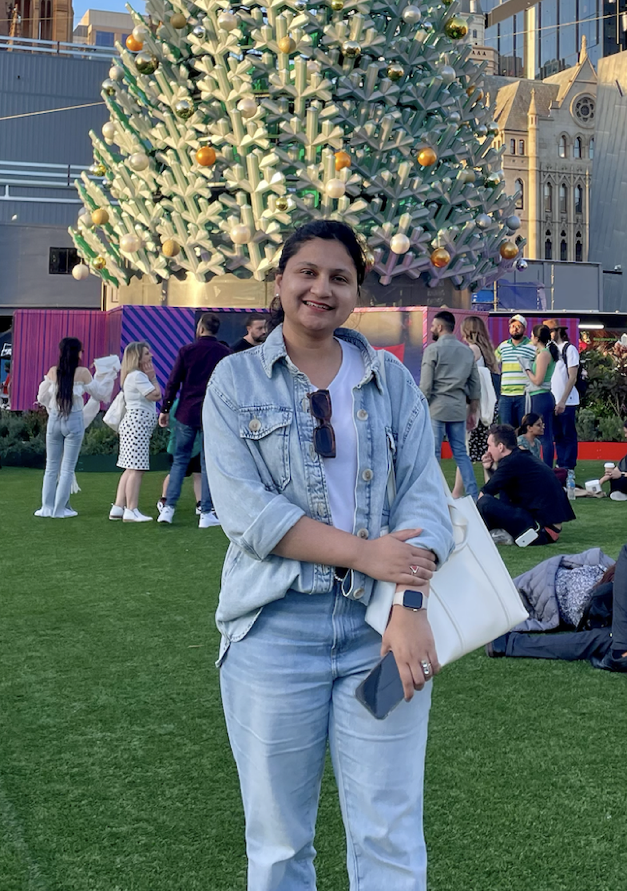

<table style="border: none;">
  <tr>
    <td style="vertical-align: top; padding: 0; border: none; width: 60%;">
      

        Hi, I am Asma Shahid. I'm a Business Analyst who enjoys making sense of complex problems and helping teams find practical, data-informed solutions. I have worked on process mapping, stakeholder collaboration, and using insights to support smarter decisions. I am always into opportunities where I can keep learning, contribute meaningfully, and be part of a team that values thoughtful analysis and clear communication.
      

    </td>
    <td style="text-align: right; padding: 0; border: none; width: 40%;">
      
    </td>
  </tr>
</table>

